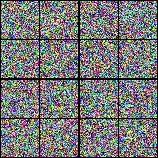
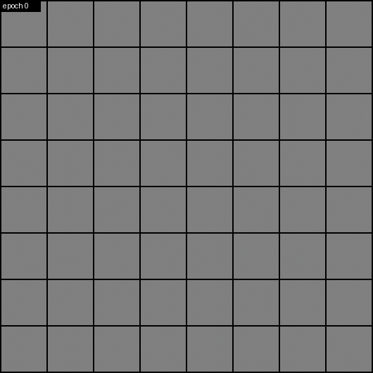
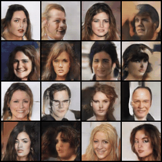
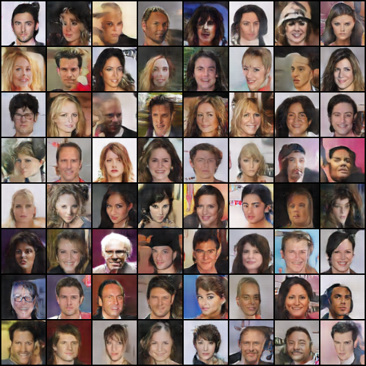

# DCGAN with PyTorch — Face Generation

A Deep Convolutional Generative Adversarial Network (DCGAN, [Radford et al., 2015](https://arxiv.org/abs/1511.06434)) trained on the CelebA dataset to generate 64×64 human faces from random noise.

The project ships as a small Python package with a YAML config, a CLI for training (checkpoints + TensorBoard) and tools to turn the generator into GIFs.

<p align="center">
  
  
  
</p>
<p align="center"><em>Left: from white noise to faces · Middle: training progress, epoch 0 → 16 · Right: walking through the latent space</em></p>

---

## Results

Faces sampled from the generator after 16 epochs:

<p align="center"></p>

- **Training:** 16 epochs on the CelebA train split (162,770 images), about 15 min per epoch on an Apple M3 GPU (MPS).
- **What to expect:** faces are recognizable from epoch 4–5. Gains are small after about 10 epochs, and losses settle around `Loss_D ≈ 0.6` / `Loss_G ≈ 2.7`.
- **Known limits:** some faces are distorted or asymmetric and backgrounds are blurry, as is typical for a vanilla DCGAN at 64×64.

---

## How it works

A DCGAN pits two convolutional networks against each other:

- **Generator** (3.6 M params): it turns a noise vector `z` (100 values) into an image.
  `z (100×1×1) → 512×4×4 → 256×8×8 → 128×16×16 → 64×32×32 → 3×64×64`
  Each step is `ConvTranspose2d → BatchNorm → ReLU`, with `Tanh` on the output.
- **Discriminator** (2.8 M params): it mirrors the generator and outputs one real/fake logit.
  Each step is `Conv2d → BatchNorm → LeakyReLU(0.2)`.

Both are trained with `BCEWithLogitsLoss` and Adam (`lr=2e-4`, `β1=0.5`), using DCGAN weight initialization.

**Data:** the aligned CelebA images (178×218) are resized to 64 on the short side, center-cropped to 64×64, and normalized to `[-1, 1]`. Image sizes must be of the form 4·2ⁿ (64 by default) to match the stride-2 architecture.

---

## Project structure

```
DCGANpytorch.ipynb     # original notebook (MNIST GAN + first CelebA DCGAN), kept as reference
configs/celeba.yaml    # all hyperparameters
dcgan/
  data.py              # CelebA dataset + dataloader
  models.py            # Generator / Discriminator
  trainer.py           # training loop, checkpoints, TensorBoard
  gif.py               # GIFs: noise→face reveal, latent interpolation, training evolution
  cli.py               # command line interface (python -m dcgan ...)
assets/                # images used in this README
```

Expected data layout (not versioned):

```
data/img_align_celeba/*.jpg
data/Eval/list_eval_partition.txt
```

---

## Usage

```bash
pip install -r requirements.txt
```

### Train

Outputs go to `runs/<experiment_name>/{checkpoints,samples,tensorboard}`.

```bash
python -m dcgan train -c configs/celeba.yaml
python -m dcgan train --set train.epochs=10 --set data.max_images=20000   # override any config key
python -m dcgan train --resume                                            # resume from the latest checkpoint
```

- **Device:** CUDA, Apple MPS or CPU is picked automatically (`device: auto`).
- **Checkpoints:** saved every epoch, keeping the last 5 (`output.keep_last`). Each checkpoint holds both networks, both optimizers, the fixed noise and the config, so resuming continues exactly where training stopped.
- **Long runs on a laptop:** keep it plugged in and awake. On macOS: `caffeinate -ims -w <training PID>`.

### Monitor

```bash
tensorboard --logdir runs     # http://localhost:6006
```

- **Scalars:** generator and discriminator losses, `D(x)` and `D(G(z))`.
- **Images:** real images, and fake images from a fixed noise vector (refreshed every 500 steps and at the end of each epoch).

### Generate

```bash
CKPT=runs/celeba_dcgan/checkpoints/epoch_0016.pt

python -m dcgan sample $CKPT -o outputs/faces.png -n 64 --seed 42                  # grid of faces
python -m dcgan gif reveal   --checkpoint $CKPT -o outputs/reveal.gif --seed 42    # white noise → faces
python -m dcgan gif interp   --checkpoint $CKPT -o outputs/morph.gif  --seed 42    # latent space morphing
python -m dcgan gif training --samples-dir runs/celeba_dcgan/samples -o outputs/training.gif
```

Useful GIF options: `-n` (number of faces), `--scale` (upscaling), `--duration` (ms per frame), `--frames` / `--hold` (reveal), `--keyframes` / `--steps` (interp). See `python -m dcgan gif -h`.

> The `reveal` GIF is a visual effect: the generator produces a face in a single forward pass, and the animation blends that face with fading Gaussian noise. The `training` GIF shows the real learning process, starting from the untrained generator at epoch 0.

---

## Possible improvements

- Higher resolution (128×128) with one extra block per network
- Spectral normalization or a WGAN-GP loss for more stable training
- Mixed precision (`torch.autocast`) for faster training
